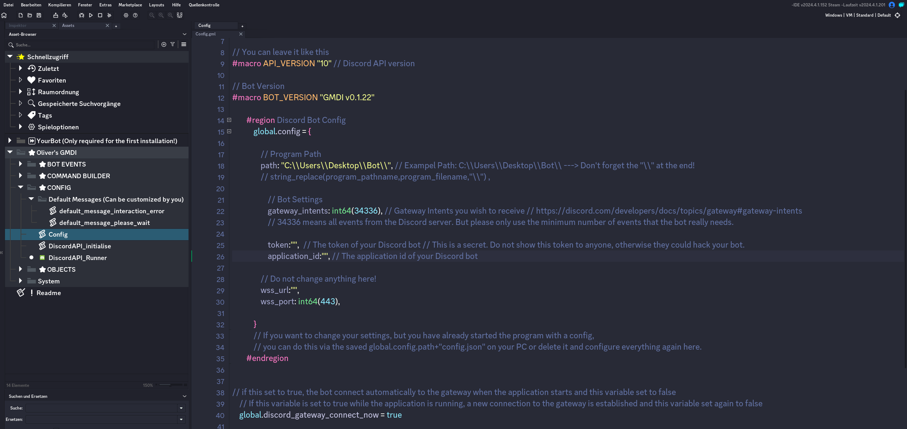

# ⭐ GMDI | GameMaker DiscordAPI Integration
GMDI (GameMaker DiscordAPI Integration) is a library (in the form of a yymps file that can be imported into GameMaker Studio) that offers an easy way to program even complex Discord bots with GameMaker. GMDI works with the live connection to the Discord gateway and with HTTP requests. 

## ⭐ Features
- a live connection to the Discord gateway and receive all Discord events
- an asynchronous system for HTTP requests and gateway connections with corresponding interception of HTTP errors and Discord Api errors
- easy response to interactions (buttons, text inputs, commands, select menus) thanks to GMDI's automatic response system
- almost all important http requests are available, new ones are added and updated
- simple building of objects that are sent to discord (such as a message: create_message("**Hello!**"))
- your bot can serve several Discord guilds at the same time and also process direct messages
- easy to attach files (.zip, .png and more). Compatible with GameMaker **Surfaces**, **Sprites** and **file paths** with supported formats (see [media_types](https://de.wikipedia.org/wiki/Internet_Media_Type))
- easier and faster configuration of your Discord bot, so you can start programming immediately.
- thanks to the **house()** system, you can easily redirect interactions to a function so that you have all the code for that interaction in one script.

> [!CAUTION]
> GMDI (OliverDoCode) assumes no liability for GameMaker projects / Discord bots that regularly exceed the 
[rate limits](https://discord.com/developers/docs/topics/rate-limits) of the API. Every developer who creates a bot with GMDI is responsible for their own project. GMDI is **open source** and can be modified and controlled by anyone. Therefore, make sure that you **ALWAYS** download the **ORIGINAL version** of GMDI and **not a modified copy** without being 100% sure that your secret data (like the Discord bot token) will not be shared with others. 

## ⭐ How to install
[Here is a video tutorial](https://www.youtube.com/watch?v=Q3g9KW8QxUM&ab_channel=OliverDoCode). 
**However, I recommend reading these instructions, as not everything is shown in the video.**

1. First check that you have the [latest version of GameMaker Studio](https://gms.yoyogames.com/ReleaseNotes.html). GMDI has only been tested with a paid version of GameMaker Studio and with the Windows operating system.

2. **Download the .yymps file.** Import the .yympd file into an empty GameMaker project (also delete the default folders and the default room in the GameMaker project)

3. Make sure that the room **DiscordBot_Interface** is set as the start room in **GMDI/System/Interface/DiscordBot_Interface** (there must be a house symbol in front of it).

4. To be able to upload/read/edit files outside of the [sanbox system](https://manual.gamemaker.io/monthly/en/Additional_Information/The_File_System.htm), make sure that the GameMaker sandbox system is deactivated in your project. 
You can do this under **Quick Access/Game Options/Windows/General/Disable file system sandbox**.

## ⭐ Configure your discord bot

1. You can create and edit your app (your Discord Bot) [here in the dev portal](https://discord.com/developers/applications)

2. You will find your token under the "Bot" tab in the dev portal. Reset it and copy it (treat the token like a password). Open GameMaker (with GMDI) and enter it in the **Config()** function under **GMDI/Config/Config()** in the variable **"token"** as a string. 
> [!CAUTION]
> Make sure that you are using an original GMDI version that you have only downloaded from [Github](https://github.com/OliverDoCode/GameMaker-DiscordAPI-Integration) or the [GMDI Discord](https://discord.com/invite/PVV3afa3GC). Otherwise there is a risk that a modified version sends secret data to others!

3. Do the same with the application id and copy it. The ID can be found under the **"General Information"** tab in the dev portal.
Also add it to the variable **"application_id"** as a string in the **Config()**.

4. Your bot must be a member of at least one Guild (Discord server).
Therefore, create an installation link in the dev portal for a guild with the scopes **"bot"** and **"applications.commands"**. 
Choose which permissions you want your bot to have on your Discord server, open the link and let it join your Discord server!
[Here is a tutorial on this](https://www.youtube.com/watch?v=Q3g9KW8QxUM&ab_channel=OliverDoCode)

5. Create a folder on your desktop where all bot files should be saved. Copy the path and add it to the **"path"** variable as a string in **Config()**. 
**IMPORTANT: Each character "\" must be double (i.e. "\\") and there must also be a "\\" at the end of the path.**
**Example: C:\\Users\\Desktop\\Bot\\**

6. Now you can start your bot and you should see that your bot is online on your Guild.